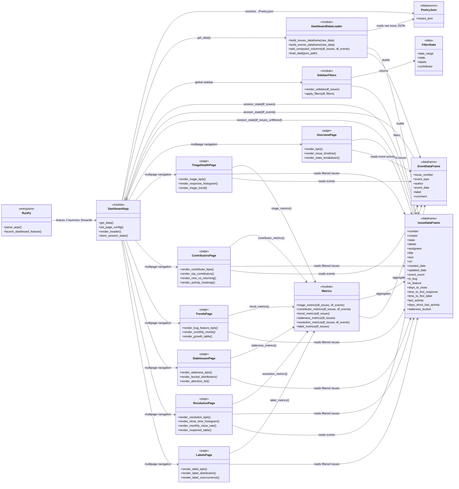

```mermaid
classDiagram
    direction LR

    class RunPy {
        <<entrypoint>>
        +parse_args()
        +launch_dashboard_feature()
    }

    class DashboardApp {
        <<module>>
        +get_data()
        +set_page_config()
        +render_header()
        +store_session_state()
    }

    class PoetryJson {
        <<datasource>>
        +issues_json
    }

    class DashboardDataLoader {
        <<module>>
        +build_issues_dataframe(raw_data)
        +build_events_dataframe(raw_data)
        +add_computed_columns(df_issues, df_events)
        +load_data(json_path)
    }

    class IssueDataFrame {
        <<dataframe>>
        +number
        +creator
        +state
        +labels
        +assignees
        +title
        +text
        +url
        +created_date
        +updated_date
        +event_count
        +is_bug
        +is_feature
        +days_to_close
        +time_to_first_response
        +time_to_first_label
        +last_activity
        +days_since_last_activity
        +staleness_bucket
    }

    class EventDataFrame {
        <<dataframe>>
        +issue_number
        +event_type
        +author
        +event_date
        +label
        +comment
    }

    class SidebarFilters {
        <<module>>
        +render_sidebar(df_issues)
        +apply_filters(df, filters)
    }

    class FilterState {
        <<data>>
        +date_range
        +state
        +labels
        +contributor
    }

    class Metrics {
        <<module>>
        +triage_metrics(df_issues, df_events)
        +contributor_metrics(df_issues, df_events)
        +trend_metrics(df_issues)
        +staleness_metrics(df_issues)
        +resolution_metrics(df_issues, df_events)
        +label_metrics(df_issues)
    }

    class OverviewPage {
        <<page>>
        +render_kpis()
        +render_issue_timeline()
        +render_state_breakdown()
    }

    class TriageHealthPage {
        <<page>>
        +render_triage_kpis()
        +render_response_histogram()
        +render_triage_trend()
    }

    class ContributorsPage {
        <<page>>
        +render_contributor_kpis()
        +render_top_contributors()
        +render_new_vs_returning()
        +render_activity_heatmap()
    }

    class TrendsPage {
        <<page>>
        +render_bug_feature_kpis()
        +render_monthly_trends()
        +render_growth_table()
    }

    class StaleIssuesPage {
        <<page>>
        +render_staleness_kpis()
        +render_bucket_distribution()
        +render_attention_list()
    }

    class ResolutionPage {
        <<page>>
        +render_resolution_kpis()
        +render_close_time_histogram()
        +render_monthly_close_rate()
        +render_reopened_table()
    }

    class LabelsPage {
        <<page>>
        +render_label_kpis()
        +render_label_distribution()
        +render_label_cooccurrence()
    }

    RunPy --> DashboardApp : feature 3 launches Streamlit
    DashboardApp --> PoetryJson : resolves ../Poetry.json
    DashboardApp --> DashboardDataLoader : get_data()
    DashboardApp --> SidebarFilters : global sidebar
    DashboardDataLoader --> PoetryJson : reads raw issue JSON
    DashboardDataLoader --> IssueDataFrame : builds
    DashboardDataLoader --> EventDataFrame : builds
    SidebarFilters --> FilterState : returns
    SidebarFilters --> IssueDataFrame : filters
    Metrics --> IssueDataFrame : aggregates
    Metrics --> EventDataFrame : aggregates

    DashboardApp o-- IssueDataFrame : session_state[df_issues]
    DashboardApp o-- EventDataFrame : session_state[df_events]
    DashboardApp o-- IssueDataFrame : session_state[df_issues_unfiltered]

    DashboardApp --> OverviewPage : multipage navigation
    DashboardApp --> TriageHealthPage : multipage navigation
    DashboardApp --> ContributorsPage : multipage navigation
    DashboardApp --> TrendsPage : multipage navigation
    DashboardApp --> StaleIssuesPage : multipage navigation
    DashboardApp --> ResolutionPage : multipage navigation
    DashboardApp --> LabelsPage : multipage navigation

    OverviewPage --> IssueDataFrame : reads filtered issues
    OverviewPage --> EventDataFrame : reads event activity

    TriageHealthPage --> Metrics : triage_metrics()
    TriageHealthPage --> IssueDataFrame : reads filtered issues
    TriageHealthPage --> EventDataFrame : reads events

    ContributorsPage --> Metrics : contributor_metrics()
    ContributorsPage --> IssueDataFrame : reads filtered issues
    ContributorsPage --> EventDataFrame : reads events

    TrendsPage --> Metrics : trend_metrics()
    TrendsPage --> IssueDataFrame : reads filtered issues

    StaleIssuesPage --> Metrics : staleness_metrics()
    StaleIssuesPage --> IssueDataFrame : reads filtered issues

    ResolutionPage --> Metrics : resolution_metrics()
    ResolutionPage --> IssueDataFrame : reads filtered issues
    ResolutionPage --> EventDataFrame : reads events

    LabelsPage --> Metrics : label_metrics()
    LabelsPage --> IssueDataFrame : reads filtered issues
```